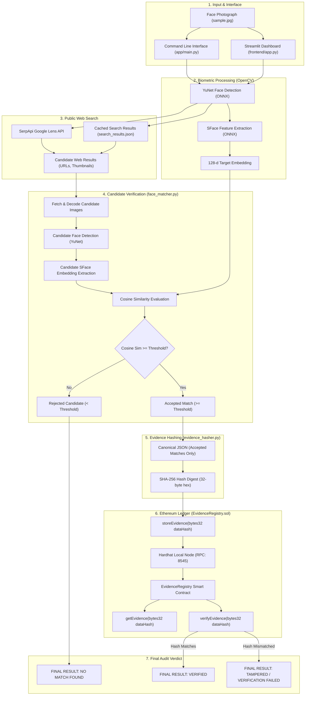

# Face Identification & Blockchain Verification

[](https://www.python.org/)
[](https://soliditylang.org/)
[](https://hardhat.org/)
[](https://opencv.org/)
[](https://streamlit.io/)
[]()

> An end-to-end pipeline that takes a face scan as input, searches the web/social media for candidate content using reverse-image search, performs **SFace facial recognition verification** against a configurable similarity threshold to accept genuine matches and reject false positives, and cryptographically anchors and audits the discovered data on an **Ethereum smart contract**.

---

## Table of Contents

1. [What the Project Does](#1-what-the-project-does)
   - [Core Concept & Pipeline Stages](#core-concept--pipeline-stages)
   - [Separation of Search vs. Blockchain Verification](#separation-of-search-vs-blockchain-verification)
   - [Strict Audit Verdicts](#strict-audit-verdicts)
   - [System Architecture Diagram](#system-architecture-diagram)
   - [Project Directory Structure](#project-directory-structure)
2. [Which Blockchain is Used](#2-which-blockchain-is-used)
   - [Network Architecture: Local Ethereum (Hardhat Network)](#network-architecture-local-ethereum-hardhat-network)
   - [Why This Blockchain?](#why-this-blockchain)
   - [Smart Contract: EvidenceRegistry.sol](#smart-contract-evidenceregistrysol)
   - [Cryptographic Hash Anchoring vs. Raw Data Storage](#cryptographic-hash-anchoring-vs-raw-data-storage)
3. [How to Run It](#3-how-to-run-it)
   - [Prerequisites](#prerequisites)
   - [Installation & Setup](#installation--setup)
   - [Environment Configuration (.env)](#environment-configuration-env)
   - [Starting the Local Blockchain & Deploying Contract](#starting-the-local-blockchain--deploying-contract)
   - [Running via Command-Line Interface (CLI)](#running-via-command-line-interface-cli)
   - [Running via Interactive Web Dashboard (Streamlit)](#running-via-interactive-web-dashboard-streamlit)
   - [Running the Automated Test Suites](#running-the-automated-test-suites)
4. [Known Limitations](#4-known-limitations)
   - [Public Web Indexing Constraints](#1-public-web-indexing-constraints)
   - [Reverse Search API Quotas & Rate Limits](#2-reverse-search-api-quotas--rate-limits)
   - [Face Similarity vs. Legal Real-World Identity](#3-face-similarity-vs-legal-real-world-identity)
   - [Local Blockchain Sandboxed State](#4-local-blockchain-sandboxed-state)
   - [Image Quality, Lighting & Extreme Head Poses](#5-image-quality-lighting--extreme-head-poses)
   - [Single Primary Face Selection](#6-single-primary-face-selection)
5. [Security & Privacy Guarantees](#5-security--privacy-guarantees)
6. [License](#6-license)

---

## 1. What the Project Does

### Core Concept & Pipeline Stages
The system establishes a verifiable, tamper-proof audit trail linking a source face image to public web occurrences discovered via reverse image search. It operates across 6 programmatic stages:

```
[ Face Scan Input ] ➔ [ 1. YuNet Face Detection ] ➔ [ 2. SFace Embedding Extraction ]
                             │
                             ▼
                 [ 3. Google Lens Reverse Search ]
                             │
                             ▼
            [ 4. SFace Candidate Verification (Cosine Similarity ≥ Threshold) ]
                ├── Similarity < Threshold  ➔ REJECT (False Positives Filtered Out)
                └── Similarity ≥ Threshold  ➔ ACCEPT (Discovered Match Set)
                             │
            ┌────────────────┴────────────────┐
            ▼                                 ▼
[ 0 Candidates Accepted ]          [ ≥ 1 Candidate Accepted ]
            │                                 │
     (Skip Blockchain)                        ▼
            │                     [ 5. Canonical JSON Structuring ]
            │                                 │
            │                     [ Deterministic SHA-256 Digest ]
            │                                 │
            │                     [ 6. Hardhat Blockchain Anchoring ]
            │                                 │
            ▼                                 ▼
FINAL RESULT: NO MATCH FOUND       [ On-Chain Proof Verification ]
                                              ├── Computed == On-Chain ➔ VERIFIED
                                              └── Computed != On-Chain ➔ TAMPERED
```

1. **Face Detection (OpenCV YuNet):** Detects human faces in the input image, identifies 5 facial landmarks (eyes, nose, mouth corners), and crops the primary face.
2. **Feature Extraction (OpenCV SFace):** Generates a 128-dimensional biometric embedding representing the unique facial geometry of the target face.
3. **Reverse-Image Web Search (SerpApi Google Lens):** Dispatches the cropped face to public reverse image search engines to identify candidate web pages, social media profiles, and indexed occurrences.
4. **Candidate Face Matching & Verification (SFace Cosine Similarity):** 
   - Downloads candidate thumbnails from the web search results.
   - Detects faces in candidate images and extracts their 128-d SFace embeddings.
   - Computes cosine similarity against the query face embedding.
   - Evaluates candidates against a **configurable similarity threshold** (e.g. user-defined or default threshold):
     - Candidates with similarity meeting or exceeding the threshold are **accepted** as confirmed matches (even a single accepted match is sufficient).
     - Candidates with similarity below the threshold are **rejected** as visual false positives.
5. **Deterministic Evidence Structuring & Hashing:**
   - Filters out non-matching candidates.
   - Structures **only accepted matches** into canonical JSON (lexicographically sorted keys, compact UTF-8, zero transient runtime paths).
   - Computes an immutable 32-byte **SHA-256 cryptographic digest**.
6. **Smart Contract Anchoring & Verification (`EvidenceRegistry.sol`):**
   - Transacts with a local Ethereum blockchain to anchor the evidence digest on-chain.
   - Queries the smart contract to retrieve the registered record (`dataHash`, `timestamp`, `uploader`).
   - Validates that the off-chain computed digest matches the on-chain ledger record.

---

### Separation of Search vs. Blockchain Verification
A core architectural feature is the strict separation between **search match detection** and **blockchain evidence verification**:
- The blockchain smart contract verifies **cryptographic evidence integrity** (whether a specific hash was registered and untouched). It does *not* query the web.
- The pipeline logic verifies **facial match presence** using SFace before creating evidence.
- If Google Lens returns visual matches but **none reach the required face similarity threshold**, the pipeline halts immediately, outputs `"NO MATCH FOUND"`, and **skips blockchain anchoring entirely**.

---

### Strict Audit Verdicts

| Scenario | Condition | System Verdict |
| :--- | :--- | :--- |
| **No Candidate Reaches Threshold** | 0 candidates reach the configured facial similarity threshold | `NO MATCH FOUND` |
| **Match Verified On-Chain** | $\ge 1$ candidate meets threshold AND computed SHA-256 matches on-chain record | `VERIFIED` |
| **Evidence Tampered** | Candidate was anchored, but evidence JSON or on-chain digest was altered | `TAMPERED / VERIFICATION FAILED` |

---

### System Architecture Diagram



---

### Project Directory Structure

```text
Face-Identification-Blockchain-Verification/
├── app/
│   ├── __init__.py
│   ├── main.py                     # CLI entrypoint with argument parsing and logging
│   ├── pipeline.py                 # Core 6-stage orchestration pipeline
│   ├── blockchain/
│   │   ├── __init__.py
│   │   └── blockchain_client.py    # Web3.py client for EvidenceRegistry contract
│   ├── face/
│   │   ├── __init__.py
│   │   ├── face_processor.py       # YuNet detection & SFace feature extraction
│   │   └── face_matcher.py         # Candidate image verification & similarity threshold filtering
│   ├── search/
│   │   ├── __init__.py
│   │   └── reverse_image_search.py # SerpApi Google Lens client & payload normalizer
│   └── utils/
│       ├── __init__.py
│       └── evidence_hasher.py      # Deterministic JSON canonicalizer & SHA-256 hasher
├── contracts/
│   └── EvidenceRegistry.sol        # Solidity smart contract for hash anchoring
├── frontend/
│   └── app.py                      # Interactive Streamlit web dashboard
├── models/
│   ├── face_detection_yunet.onnx   # OpenCV YuNet face detection model
│   └── face_recognition_sface.onnx # OpenCV SFace face recognition model
├── scripts/
│   └── deploy.js                   # Hardhat deployment script for EvidenceRegistry
├── tests/
│   ├── test_face_processor.py      # YuNet & SFace unit tests
│   ├── test_face_matcher.py        # Candidate matching & threshold verification tests
│   ├── test_reverse_search.py      # Search normalization & error handling tests
│   ├── test_evidence_hasher.py     # Deterministic canonicalization & SHA-256 tests
│   ├── test_blockchain_client.py   # Web3 client interaction tests
│   ├── test_pipeline.py            # End-to-end pipeline & regression tests
│   └── test_frontend.py            # Streamlit app component tests
├── input/
│   └── sample.jpg                  # Reference test face photograph
├── output/                         # Generated artifacts (crops, canonical JSON, digests)
├── .env.example                    # Template for environment configuration
├── hardhat.config.js               # Hardhat network & Solidity compiler config
├── package.json                    # Node.js dependencies & npm scripts
├── requirements.txt                # Python dependencies
└── README.md                       # Complete project documentation
```

---

## 2. Which Blockchain is Used

### Network Architecture: Local Ethereum (Hardhat Network)

This project runs on a **Local Ethereum Blockchain Network** powered by **Hardhat**:
- **Protocol:** Ethereum Virtual Machine (EVM)
- **Node Implementation:** Hardhat Network JSON-RPC Node
- **RPC Endpoint:** `http://127.0.0.1:8545`
- **Chain ID:** `31337`
- **Smart Contract Language:** Solidity (`^0.8.28`)
- **Python Integration Library:** `web3.py` (v7.x)

---

### Why This Blockchain?

1. **Zero Financial Cost (Gas-Free Development):** Running on a local Hardhat network eliminates the requirement for real cryptocurrency or testnet faucet tokens, enabling free, unlimited transaction execution for academic and enterprise evaluation.
2. **Deterministic, Instant Block Confirmation:** Hardhat mines blocks instantaneously upon transaction submission (`automine: true`). This removes the 12–60 second latency common on public testnets (e.g., Sepolia) and ensures fast, deterministic testing.
3. **Reproducible Sandboxed Environment:** The local network provides 20 pre-funded test accounts with known private keys, making the setup completely self-contained and reproducible across developer machines without external wallet plugins (e.g., MetaMask).
4. **Full EVM Compatibility:** The Solidity smart contract (`EvidenceRegistry.sol`) is compiled using the standard EVM toolchain. It can be deployed directly to Ethereum Mainnet, Polygon, Arbitrum, or Optimism without modifying a single line of Solidity code.

---

### Smart Contract: `EvidenceRegistry.sol`

The `EvidenceRegistry` contract acts as an immutable, decentralized notary ledger:

```solidity
// SPDX-License-Identifier: MIT
pragma solidity ^0.8.28;

contract EvidenceRegistry {
    struct Evidence {
        bytes32 dataHash;
        uint256 timestamp;
        address uploader;
    }

    mapping(bytes32 => Evidence) private registry;

    event EvidenceStored(bytes32 indexed dataHash, uint256 timestamp, address indexed uploader);

    function storeEvidence(bytes32 dataHash) external {
        require(dataHash != bytes32(0), "Invalid hash: zero hash not allowed");
        require(registry[dataHash].timestamp == 0, "Evidence hash already exists");

        registry[dataHash] = Evidence({
            dataHash: dataHash,
            timestamp: block.timestamp,
            uploader: msg.sender
        });

        emit EvidenceStored(dataHash, block.timestamp, msg.sender);
    }

    function getEvidence(bytes32 dataHash) external view returns (bytes32, uint256, address) {
        Evidence memory ev = registry[dataHash];
        require(ev.timestamp != 0, "Evidence hash not found");
        return (ev.dataHash, ev.timestamp, ev.uploader);
    }

    function verifyEvidence(bytes32 dataHash) external view returns (bool) {
        return registry[dataHash].timestamp != 0;
    }
}
```

- **`storeEvidence(bytes32 dataHash)`**: Records the 32-byte digest, stores the block timestamp (`block.timestamp`), and records the sender's account address (`msg.sender`). Reverts on zero hash or duplicate submission.
- **`getEvidence(bytes32 dataHash)`**: Retrieves the stored audit record (`dataHash`, `timestamp`, `uploader`). Reverts if unanchored.
- **`verifyEvidence(bytes32 dataHash)`**: Read-only check returning boolean `true`/`false`.

---

### Cryptographic Hash Anchoring vs. Raw Data Storage

Storing full facial images or web search JSON responses directly on an Ethereum blockchain is fundamentally flawed:
- **Storage Cost:** Storing 1 MB of raw data on Ethereum costs thousands of dollars in gas.
- **Data Privacy Violations:** Storing biometric images or personally identifiable web records violates GDPR/CCPA privacy rights, as data on public blockchains cannot be deleted.

**The Solution:** The pipeline computes an off-chain deterministic SHA-256 digest of the canonical evidence payload and anchors **only the 32-byte hash (`bytes32`)** on-chain. If even a single character in the evidence payload is modified off-chain, the re-computed SHA-256 digest diverges completely, failing on-chain validation.

---

## 3. How to Run It

### Prerequisites

Ensure the following runtimes are installed on your machine:
- **Python:** Version `3.10` or higher
- **Node.js:** Version `18.x` or higher (includes `npm`)
- **Git**

---

### Installation & Setup

1. **Clone the Repository:**
   ```bash
   git clone https://github.com/JinayPatel15/Face-Identification-Blockchain-Verification.git
   cd Face-Identification-Blockchain-Verification
   ```

2. **Set Up Python Virtual Environment:**
   ```bash
   # On Windows:
   python -m venv .venv
   .venv\Scripts\activate

   # On Linux/macOS:
   python3 -m venv .venv
   source .venv/bin/activate
   ```

3. **Install Python Dependencies:**
   ```bash
   pip install -r requirements.txt
   ```

4. **Install Node.js Dependencies & Compile Contracts:**
   ```bash
   npm install
   npx hardhat compile
   ```

5. **Verify Pre-trained ONNX Models:**
   Ensure the following model files exist in the `models/` folder:
   - `models/face_detection_yunet.onnx`
   - `models/face_recognition_sface.onnx`

---

### Environment Configuration (`.env`)

Copy the template file to create your active `.env`:
```bash
cp .env.example .env
```

Ensure `.env` contains the required configuration:
```env
# SerpApi API key for live Google Lens reverse image queries (Optional if using --use-cached-search)
SERPAPI_API_KEY=your_serpapi_key_here

# Local Hardhat Node JSON-RPC Provider
BLOCKCHAIN_RPC_URL=http://127.0.0.1:8545

# Deployed EvidenceRegistry Smart Contract Address (Output by deployment script)
CONTRACT_ADDRESS=0x5FbDB2315678afecb367f032d93F642f64180aa3

# Hardhat Local Test Account #0 Private Key (Pre-funded development account; never use with real funds)
BLOCKCHAIN_PRIVATE_KEY=0xac0974bec39a17e36ba4a6b4d238ff944bacb478cbed5efcae784d7bf4f2ff80
```

---

### Starting the Local Blockchain & Deploying Contract

1. **Terminal 1 — Start the Hardhat Node:**
   ```bash
   npm run node
   ```
   *(Keep this terminal running. It hosts the local Ethereum network on `http://127.0.0.1:8545`)*.

2. **Terminal 2 — Deploy the Smart Contract:**
   ```bash
   npm run deploy
   ```
   *Expected output:*
   ```text
   EvidenceRegistry deployed to: 0x5FbDB2315678afecb367f032d93F642f64180aa3
   ```
   *(Ensure the address in `.env` matches this deployed address).*

---

### Running via Command-Line Interface (CLI)

#### 1. Default Verification Run (Cached Search, Configurable Threshold)
Use the included reference image and cached search results to run the pipeline without consuming search API quota:
```bash
python app/main.py --input input/sample.jpg --use-cached-search
```

**Output when candidates fall below the similarity threshold (Different Persons):**
```text
======================================================================
FACE IDENTIFICATION & BLOCKCHAIN VERIFICATION
======================================================================

[1/6] Face Detection
      Input image:      sample.jpg (768x1024 px)
      Faces detected:   1

[2/6] Face Selection & Feature Extraction
      Primary face:     Index 0 (highest confidence)
      Confidence:       0.9337
      Bounding box:     [x=348, y=437, w=89, h=103]
      SFace embedding:  Shape (1, 128) (128-d float32 vector)

[3/6] Reverse-Image Search
      Mode:             CACHED

[4/6] Candidate Face Matching & Verification
      Similarity thresh: Configurable (User Threshold)
      Candidates:        60
      Accepted matches:  0 (>= Threshold)
      Rejected count:    60 (< Threshold or no face)
        #1 [REJECTED] Similarity: 51.0% | LinkedIn: Sahil Jana - Ex-SDE Intern
        #2 [REJECTED] Similarity: 50.1% | GitHub: dhairyashiil (Dhairyashil Shinde)
        #3 [REJECTED] Similarity: 49.0% | LinkedIn: Ayush Khatavkar - Financial

      ============================================================
      NO MATCHING WEB CONTENT FOUND
      0 candidates reached the similarity threshold.
      Blockchain verification not performed because no matching web/social evidence was discovered.
      ============================================================

======================================================================
FINAL RESULT: NO MATCH FOUND
======================================================================
```

#### 2. Verification Run with Candidate Matching Acceptance
Run with a threshold of `0.50` to demonstrate the full acceptance, canonical evidence creation, and on-chain anchoring flow:
```bash
python app/main.py --input input/sample.jpg --use-cached-search --similarity-threshold 0.50
```

**Output when candidate is $\ge 50\%$:**
```text
[4/6] Candidate Face Matching & Verification
      Accepted matches:  1 (>= 50.0%)
      Rejected count:    59 (< 50.0% or no face)
        #1 [ACCEPTED] Similarity: 51.0% | LinkedIn: Sahil Jana

[5/6] Evidence Hashing
      Canonical data:   canonical_evidence.json (463 bytes, 1 match)
      SHA-256 Digest:   0x640f80f00c286445384ba85ac6e5910c19c304c0e102266ffc6c5da7042201e7
      Hash file saved:  evidence_hash.txt

[5/6] Blockchain Anchoring
      RPC Node:         http://127.0.0.1:8545
      Contract Address: 0x5FbDB2315678afecb367f032d93F642f64180aa3
      Status:           NEWLY ANCHORED
      Transaction:      78f111faebabe6bc158fd34c212d62f418bcd7544527b24d2a535012e738b46c

[6/6] Blockchain Verification
      Computed hash:    0x640f80f00c286445384ba85ac6e5910c19c304c0e102266ffc6c5da7042201e7
      On-chain hash:    0x640f80f00c286445384ba85ac6e5910c19c304c0e102266ffc6c5da7042201e7
      Block Timestamp:  2026-09-05 18:11:05 UTC (UNIX 1788631865)
      On-chain verify:  TRUE

======================================================================
FINAL RESULT: VERIFIED
======================================================================
```

#### 3. Live Google Lens Search
Run with live reverse image search using your SerpApi key:
```bash
python app/main.py --input path/to/your/photo.jpg
```

#### CLI Options Reference

| Argument | Short | Default | Description |
| :--- | :---: | :---: | :--- |
| `--input` | `-i` | `input/sample.jpg` | Path to input image file containing a face |
| `--output-dir` | `-o` | `output` | Directory where output crops, JSON, and hashes are stored |
| `--use-cached-search` | | `False` | Use local cached search results instead of live SerpApi call |
| `--similarity-threshold`| | `0.90` | Cosine similarity threshold for SFace match acceptance |
| `--max-results` | `-n` | `5` | Maximum representative candidates to display |
| `--score-threshold` | | `0.60` | Minimum confidence threshold for YuNet face detection |

---

### Running via Interactive Web Dashboard (Streamlit)

Launch the interactive web application in your browser:
```bash
streamlit run frontend/app.py
```
Open **`http://localhost:8501`** in your browser.

#### Dashboard Features
- **Sidebar Image Upload:** Upload any `.jpg`, `.png`, or `.webp` portrait or select the preloaded sample.
- **Interactive Threshold Slider:** Dynamically adjust the SFace Match Threshold to any arbitrary value between 50% and 100%.
- **Interactive Horizontal Flow Diagram:** Visual progress tracking indicating stage completion or early skip branches.
- **5 Detailed Audit Tabs:**
  1. **📊 Overview:** Displays verdict banner (`VERIFIED`, `NO MATCH FOUND`, or `TAMPERED / VERIFICATION FAILED`) and key metrics.
  2. **👤 Face Detection:** Visualizes bounding box, 5 landmarks, cropped portrait, and SFace feature vector properties.
  3. **🌐 Web Matches:** Shows accepted matches with green similarity badges and an expandable list of rejected candidates showing similarity percentages.
  4. **🔒 Evidence & SHA-256:** Shows canonical JSON evidence, byte payload size, and the 64-character SHA-256 digest.
  5. **⛓️ Blockchain Ledger:** Displays on-chain coordinates, uploader address, transaction hash, block timestamp, and verification status.

---

### Running the Automated Test Suites

#### 1. Python Unit & Orchestration Tests (76 Tests)
Run the complete Python test suite covering face processing, candidate matching, threshold segregation, search normalization, canonical hashing, and pipeline orchestration:
```bash
python -m unittest discover -s tests -p "test_*.py"
```
*Result:* `Ran 76 tests in 1.030s — OK`

#### 2. Solidity Smart Contract Tests (8 Tests)
Run the Hardhat contract test suite verifying contract deployment, hash storage, zero-hash rejection, duplicate prevention, and verification queries:
```bash
npx hardhat test
```
*Result:* `8 passing (644ms)`

---

## 4. Known Limitations

### 1. Public Web Indexing Constraints
- The pipeline queries Google Lens via SerpApi. If a person's photograph has **never been uploaded to a publicly indexed web page** (e.g., social media profiles, public directories, blogs, news articles), reverse image search returns zero matching results.
- Unindexed private records, password-protected sites, or intranet systems cannot be queried.

### 2. Reverse Search API Quotas & Rate Limits
- Live reverse image search relies on external APIs (SerpApi). Free-tier API keys provide a limited quota (e.g., 100 searches/month).
- *Mitigation:* The project implements a cached search mode (`--use-cached-search`) that loads previously cached search results from `output/search_results.json`, allowing complete local testing and demonstration without consuming API credits.

### 3. Face Similarity vs. Legal Real-World Identity
- SFace cosine similarity measures visual facial geometry likeness between a query crop and a web thumbnail.
- While a score meeting the configured threshold confirms that the face in the web content is visually identical to the target, **it does not legally or medically confirm the real-world legal identity** of the person (e.g., does not replace passport validation, KYC document checks, or biometric liveness detection).

### 4. Local Blockchain Sandboxed State
- The default setup runs on a local Hardhat node in memory. If the `npm run node` process is stopped or restarted, the on-chain ledger resets unless state persistence is explicitly enabled.
- *Mitigation:* The Python client detects if a node was restarted and alerts the user to re-run `npm run deploy`. For permanent testnet deployment, the same contract can be pointed to Ethereum Sepolia or an EVM-compatible L2.

### 5. Image Quality, Lighting & Extreme Head Poses
- Low-resolution crops ($< 300\times 300$ pixels) or heavily compressed web thumbnails can reduce the confidence of YuNet detection and SFace feature extraction.
- Extreme head pose angles (yaw or pitch $> 45^\circ$) or partial facial occlusion (heavy sunglasses, masks) can reduce similarity scores below the configured acceptance threshold.

### 6. Single Primary Face Selection
- If an uploaded photo contains multiple people (e.g., group photo), the pipeline automatically selects the **single primary face** with the highest detection confidence score. Multi-subject batch identification from a single group photograph is not currently supported.

---

## 5. Security & Privacy Guarantees

- **No Biometric Storage On-Chain:** Biometric feature vectors (128-dimensional floating point embeddings) and facial portrait images are **never submitted to the blockchain**. Only deterministic 32-byte cryptographic hashes of web evidence are recorded on-chain.
- **Zero Credential Leaking:** The canonical evidence payload strips all local filesystem paths, API keys, private keys, and runtime machine timestamps.
- **Deterministic Serialization:** JSON serialization enforces lexicographical sorting and compact formatting (`separators=(',', ':')`), ensuring the exact same SHA-256 digest is produced on Windows, Linux, and macOS.
- **Isolated Development Keys:** Hardhat's default test account private key is strictly restricted to local development (`Chain ID 31337`).

---

## 6. License

This project is licensed under the MIT License. See the [LICENSE](LICENSE) file for details.
